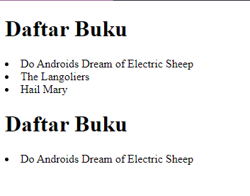
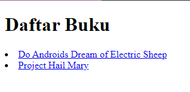
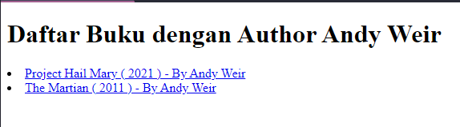

# ASSOCIATIVE ARRAY

#### Associative array adalah jenis array yang memungkinkan pengguna untuk mengindeks elemen array menggunakan kunci bukan hanya indeks numerik seperti pada array biasa. Kunci ini dapat berupa string atau angka, dan dapat diberikan oleh pengguna saat membuat array.

```
<?php
$books = [
  "Do Androids Dream of Electric Sheep",
  "The Langoliers",
  "Hail Mary"
];
?>
```

untuk pemanggilan array associative, kita dapat menggunakan perulangan seperti *for, foreach, while, do-while*.

```
<h1>Daftar Buku</h1>
    <?php // untuk menampilkan semua array?>
    <?php foreach ($books as $book) : ?>
        <li><?= $book ?></li>
    <?php endforeach ?>


   <?php // untuk menampilkan array spesifik?>
    <h1>Daftar Buku</h1>
    <li><?= $books[0] ?></li>
```

output :<br>



#### contoh associative array dengan multidimensional

```
    $books= [
        [
            'name' => 'Do Androids Dream of Electric Sheep',
            'author' => 'Philips K. Dick',
            'purchaseUrl' => 'http://example.com'
        ],
        [
            'name' => 'Project Hail Mary',
            'author' => 'Andy Weir',
            'purchaseUrl' => 'http://example.com'
        ]
        ];
    ?>
```

untuk pemanggilan array associative, kita dapat menggunakan perulangan seperti *for, foreach, while, do-while*.

```
    <?php foreach ($books as $book) : ?>
    <li>
        <a href="<?= $book['purchaseUrl'] ?>">
            <?= $book['name'] ?>
        </a>
    </li>
<?php endforeach ?>
```

akan menghasilkan output seperti ini :<br>



contoh lainnnya pemanggilan array associative dengan  kondisi.

Daftar Array :
```
<?php
$books=[
    [
        'name' => 'Do Androids Dream of Electric Sheep',
        'author' => 'Philips K. Dick',
        'releaseYear' => 1968,
        'purchaseUrl' => 'http://example.com'
    ],
    [
        'name' => 'Project Hail Mary',
        'author' => 'Andy Weir',
        'releaseYear' => 2021,
        'purchaseUrl' => 'http://example.com'
    ],
    [
        'name' => 'The Martian',
        'author' => 'Andy Weir',
        'releaseYear' => 2011,
        'purchaseUrl' => 'http://example.com'
    ],
];
?>

```

Pemanggilan Array :
```
<?php foreach ($books as $book) : ?>
    <?php if($book['author'] === 'Andy Weir') :?>
        <li>
            <a href="<?= $book['purchaseUrl'] ?>">
                <?= $book['name'] ?> ( <?= $book['releaseYear'] ?> ) - By <?= $book['author'] ?>
            </a>
        </li>
    <?php endif; ?>
<?php endforeach ?>
```

output :<br>



    


