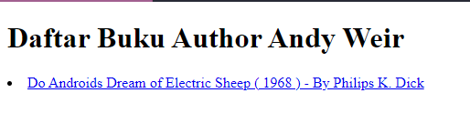

# FUNCTIONS AND FILTERING

#### blok kode yang dapat dipanggil atau dijalankan kapan saja selama program berjalan. Function dapat menerima argumen dan mengembalikan nilai, atau dapat juga tidak menerima argumen dan/atau tidak mengembalikan nilai.

#### Fungsi pada PHP sangat berguna untuk mempermudah pembuatan program, karena kita dapat memecah program menjadi beberapa bagian dengan fungsi-fungsi yang terpisah dan memproses masukan dengan fungsi tersebut, kemudian menghasilkan keluaran.

### contoh fungsi memanggil author tertentu.

- data array yang akan dipanggil

```
<?php
    $books=[
        [
            'name' => 'Do Androids Dream of Electric Sheep',
            'author' => 'Philips K. Dick',
            'releaseYear' => 1968,
            'purchaseUrl' => 'http://example.com'
        ],
        [
            'name' => 'Project Hail Mary',
            'author' => 'Andy Weir',
            'releaseYear' => 2021,
            'purchaseUrl' => 'http://example.com'
        ],
        [
            'name' => 'The Martian',
            'author' => 'Andy Weir',
            'releaseYear' => 2011,
            'purchaseUrl' => 'http://example.com'
        ],
    ];
?>
```
 - fungsi yang akan memanggil author tertentu
```
 <?php
    function filterByAuthor($books){
        $filteredBooks = [];
        foreach ($books as $book){
            if($book['author'] === 'Andy Weir'){
                $filteredBooks[] = $book;
            }
        }
        return $filteredBooks;
    }
    ?>
```


### kode untuk memanggil fungsi yang telah dibuat
```
<?php foreach (filterByAuthor($books) as $book) : ?>
        <li>
            <a href="<?= $book['purchaseUrl'] ?>">
                <?= $book['name'] ?> ( <?= $book['releaseYear'] ?> ) - By <?= $book['author'] ?>
            </a>
        </li>
    <?php endforeach ?>
```

- output:


### contoh fungsi memanggil author tertentu dengan argumen.
- fungsi yang akan memanggil author tertentu dengan argumen
```
<?php
function filterByAuthor($books, $author){
    $filteredBooks = [];
    foreach ($books as $book){
        if($book['author'] === $author){
            $filteredBooks[] = $book;
        }
    }
    return $filteredBooks;
}
?>
```

- kode untuk memanggil fungsi yang telah dibuat
```
<h1>Daftar Buku Author Andy Weir</h1>
<?php foreach (filterByAuthor($books, 'Philips K. Dick') as $book) : ?>
    <li>
        <a href="<?= $book['purchaseUrl'] ?>">
            <?= $book['name'] ?> ( <?= $book['releaseYear'] ?> ) - By <?= $book['author'] ?>
        </a>
    </li>
<?php endforeach ?>
```

- output:<br>
